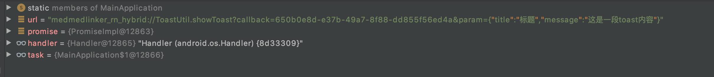
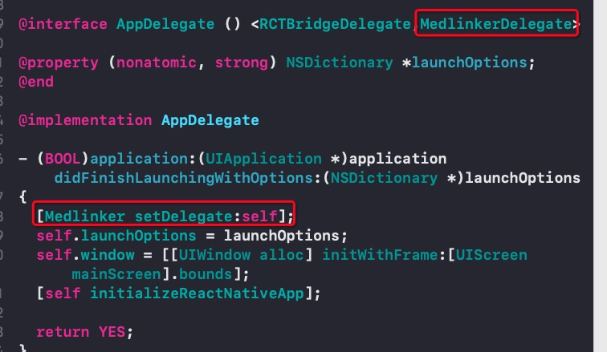
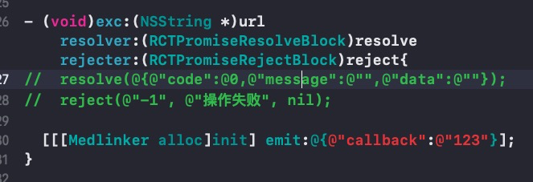
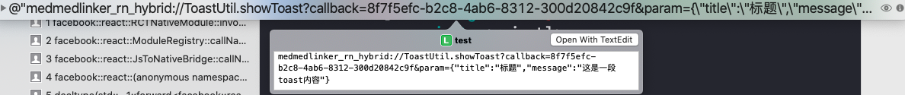

# react-native-hybrid
react-native js端对Android以及iOS通过url解析的形式进行统一方法调用、函数回调以及native事件通知响应
### 0、安装方式
npm install react-native-hybrid --save

### 1、rn端js异步调用native方法
```js
import RnHybrid from 'react-native-hybrid';
const testFunc = async ()=>{
let data = await RnHybrid.exc('ToastUtil', 'showToast', {
      title: '标题',
      message: '这是一段toast内容',
    });
}
```

### 2、rn端js异步调用native方法并实时响应native的事件通知
```js
import RnHybrid from 'react-native-hybrid';
const testFunc = ()=>{
let eventResumable = RnHybrid.createEventResumable((progress) => {
      console.log('上传文件进度', progress);
    });
    eventResumable.exc('FileUtil', 'uploadFile', {
      url: '文件地址',
    });
   //在componentWillUnmount生命周期函数调用以下方法移除订阅
   eventResumable._removeSubscription();
}
```

### 3、Android端集成和通信方式
```java
public static MedlinkerPackage medlinkerPackage = new MedlinkerPackage((url, promise) -> {
   //根据url解析moduleName、methodName和params进行方法调用
    //异步回调
    promise.resolve(data);
    promise.reject(err);       
 
    //数据通知更新，记住一定要传入callback参数，callback是url里面的参数，js端会根据callback进行指定函数回调更新
    Bundle bundle = new Bundle();
    bundle.putString("callback",callback);
    bundle.putString("data","回传数据");
    MainApplication.medlinkerPackage.eventEmitterModule.emit(bundle);
});
private final ReactNativeHost mReactNativeHost =
        new ReactNativeHost(this) {
            @Override
            public boolean getUseDeveloperSupport() {
                return BuildConfig.DEBUG;
            }
 
            @Override
            protected List<ReactPackage> getPackages() {
                @SuppressWarnings("UnnecessaryLocalVariable")
                List<ReactPackage> packages = new PackageList(this).getPackages();
                packages.add(medlinkerPackage);
                return packages;
            }
 
            @Override
            protected String getJSMainModuleName() {
                return "index";
            }
        };
```
+ Android端调用url格式如下：


### 4、iOS端实现MedlinkerDelegate代理




### 5、iOS端调用url格式如下：
